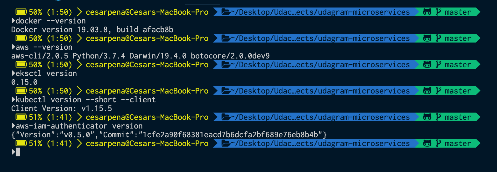
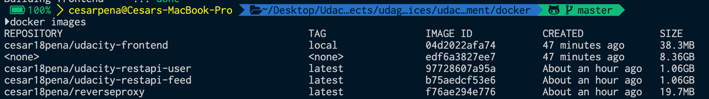
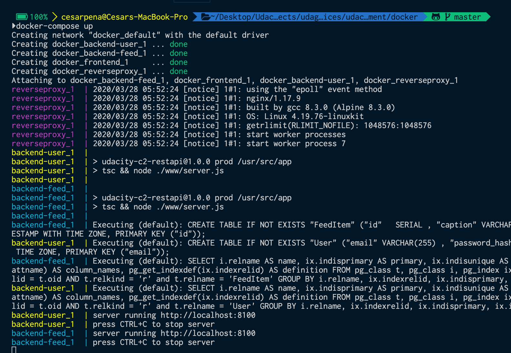
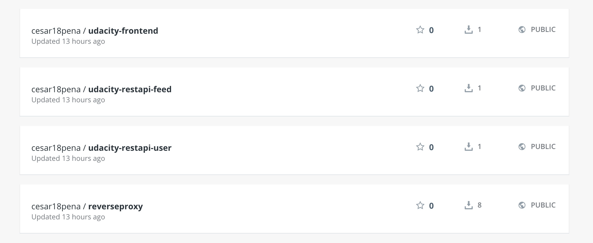

# Udagram Microservices - (Udacity Cloud Developer Nanodegree)

## Getting Started
Udagram is a simple cloud application developed as one of the Udacity Cloud Engineering Nanodegree. The idea of the project is to design, deploy and operate a cloud native photo sharing application.

### Requirement Tools:
You need to install the following programs in your computer:  
- [Docker](https://docs.docker.com/docker-for-mac/install/)  
- [AWS CLI](https://docs.aws.amazon.com/cli/latest/userguide/install-macos.html)  
- [Eksctl](https://docs.aws.amazon.com/eks/latest/userguide/getting-started-eksctl.html)  
- [AWS-iam-authenticator](https://docs.aws.amazon.com/eks/latest/userguide/install-aws-iam-authenticator.html)  
- [Kubectl](https://docs.aws.amazon.com/eks/latest/userguide/install-kubectl.html)  

### Installation
Check if your installation were successful with the following commands:  
- `docker --version`  
- `aws --version`  
- `eksctl version`  
- `kubectl version --short --client`  
- `aws-iam-authenticator version`  

  


### Setup Environment Variables
Open your terminal profile to store your application variables: 
```
nano ~/.zshrc
```
Copy and paste the lines in your file with your values:
```
export POSTGRESS_USERNAME=(Username of the database);
export POSTGRESS_PASSWORD=(Password of the database);
export POSTGRESS_DB=(Name of the Database);
export POSTGRESS_HOST=(URL Endpoint provided by AWS);
export AWS_REGION=(Region where your database is hosted);
export AWS_PROFILE=(Name of the IAM profile with correct access);
export AWS_BUCKET=(Name of S3 bucket);
export JWT_SECRET=(Random String to use JWT);
```

```
source ~/.zshrc
```

*Note: I personally use ZSH terminal in case you use BASH terminal , you will need to enter those values in your `.bash_profile`*

### Setup Docker Environment

- First build the images: 
  - `docker-compose -f docker-compose-build.yaml build --parallel`  
  
- Second list your docker images to check if they have been built:
  - `docker images` 
   
  

- Third Run your docker containers: 
  - `docker-compose up`
  - To exit run `control + C`  

  

- Fourth push your docker images:
  - `docker-compose -f docker-compose-build.yaml push`  
  
- Fifth check your Docker Hub account to check if the images were uploaded:
  
